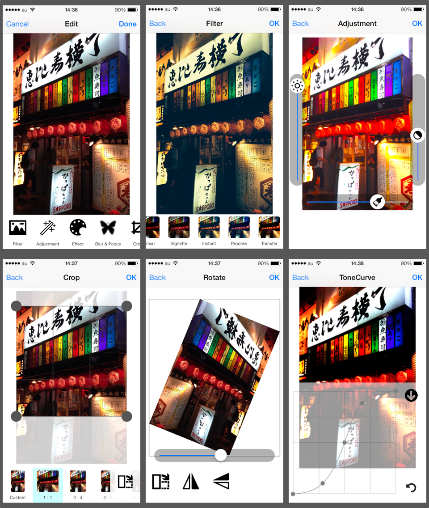

CLImageEditor
===

CLImageEditor provides basic image editing features to iPhone apps. This ViewController is simple to use, and is also possible to incorporate as part of the UIImagePickerController easily.





Installing
---

The easiest way to use CLImageEditor is to copy all the files in the CLImageEditor group (or directory) into your app. Add the following frameworks to your project (Build Phases > Link Binary With Libraries): Accelerate, CoreGraphics, CoreImage.

And optional tools are in OptionalImageTools. You might want to add as needed.

##### Or git submodule

Alternatively, you should be able to setup a [git submodule](http://git-scm.com/docs/git-submodule) and reference the files in your Xcode project.

`git submodule add https://github.com/yackle/CLImageEditor.git`

##### Or CocoaPods

[CocoaPods](http://cocoapods.org/) is a dependency manager for Objective-C projects.

`pod 'CLImageEditor'`

or

`pod 'CLImageEditor/AllTools'`

By specifying AllTools subspec, all image tools including optional tools are installed.

#### Optional Image Tools

There are the following optional tools.

`pod 'CLImageEditor/ResizeTool'`

`pod 'CLImageEditor/StickerTool'`

`pod 'CLImageEditor/TextTool'`

`pod 'CLImageEditor/SplashTool'`


Usage
---
Getting started with CLImageEditor is dead simple. Just initialize it with an UIimage and set a delegate. Then you can use it as a usual ViewController.


```  objc

#import "CLImageEditor.h"

@interface ViewController()
<CLImageEditorDelegate>
@end

- (void)presentImageEditorWithImage:(UIImage*)image
{
    CLImageEditor *editor = [[CLImageEditor alloc] initWithImage:image];
    editor.delegate = self;
	
    [self presentViewController:editor animated:YES completion:nil];
}

```

When used with UIImagePickerController, CLImageEditor can be made to function as a part of the picker by to call the picker's `pushViewController:animated:`.

```  objc

#pragma mark- UIImageController delegate

- (void)imagePickerController:(UIImagePickerController *)picker didFinishPickingMediaWithInfo:(NSDictionary *)info
{
    UIImage *image = [info objectForKey:UIImagePickerControllerOriginalImage];
    
    CLImageEditor *editor = [[CLImageEditor alloc] initWithImage:image];
    editor.delegate = self;
    
    [picker pushViewController:editor animated:YES];
}

```

After a image has been edited, the editor will call delegate's `imageEditor:didFinishEdittingWithImage:` method. The delegate's method is required to receive edited image.

```  objc


#pragma mark- CLImageEditor delegate

- (void)imageEditor:(CLImageEditor *)editor didFinishEdittingWithImage:(UIImage *)image
{
    _imageView.image = image;
    [editor dismissViewControllerAnimated:YES completion:nil];
}

```

Additionally, the optional delegate's `imageEditorDidCancel:` method is provided for when you want to catch the cancel callback.

For more detail,  please see `CLImageEditorDemo`.


Customizing
---
Icon images are included in `CLImageEditor.bundle`.  You can change the appearance by rewriting the icon images.

Other features for theme settings not yet implemented.


##### Menu customization

Image tools can customize using `CLImageToolInfo`. CLImageEditor's `toolInfo` property has functions to access each tool's info. For example, `subToolInfoWithToolName:recursive:` method is used to get the tool info of a particular name.

```  objc
CLImageEditor *editor = [[CLImageEditor alloc] initWithImage:_imageView.image];
editor.delegate = self;

CLImageToolInfo *tool = [editor.toolInfo subToolInfoWithToolName:@"CLToneCurveTool" recursive:NO];
```

After getting a tool info, by changing its properties, you can customize the image tool on menu view.

```  objc
CLImageToolInfo *tool = [editor.toolInfo subToolInfoWithToolName:@"CLToneCurveTool" recursive:NO];
tool.title = @"TestTitle";
tool.available = NO;     // if available is set to NO, it is removed from the menu view.
tool.dockedNumber = -1;  // Bring to top
//tool.iconImagePath = [[NSBundle mainBundle] pathForResource:@"test" ofType:@"png"];
```

* `dockedNumber` determines the menu item order. Note that it is simply used as a key for sorting.

The list of tool names can be confirmed with the following code.

```  objc
NSLog(@"%@", editor.toolInfo);
NSLog(@"%@", editor.toolInfo.toolTreeDescription);
```

Currently, here are the tools for iOS 7:
```
CLFilterTool
	CLDefaultEmptyFilter
	CLDefaultLinearFilter
	CLDefaultVignetteFilter
	CLDefaultInstantFilter
	CLDefaultProcessFilter
	CLDefaultTransferFilter
	CLDefaultSepiaFilter
	CLDefaultChromeFilter
	CLDefaultFadeFilter
	CLDefaultCurveFilter
	CLDefaultTonalFilter
	CLDefaultNoirFilter
	CLDefaultMonoFilter
	CLDefaultInvertFilter    
CLAdjustmentTool
CLEffectTool
	CLEffectBase
	CLSpotEffect
	CLHueEffect
	CLHighlightShadowEffect
	CLBloomEffect
	CLGloomEffect
	CLPosterizeEffect
	CLPixellateEffect
CLBlurTool
CLRotateTool
CLClippingTool
CLResizeTool
CLToneCurveTool
CLStickerTool
CLTextTool
```


Some tools have `optionalInfo` property and it makes it possible to customize more detail.

###### Clipping tool

Clipping tool allows you to set preset ratios and portrait/landscape button visibility.

``` objc
NSArray *ratios = @[
                    @{@"value1":@0, @"value2":@0,       @"titleFormat":@"Custom"}, // if either value is zero, free form is set.
                    @{@"value1":@1, @"value2":@1,       @"titleFormat":@"%.1f : %.1f"},
                    @{@"value1":@1, @"value2":@1.618,   @"titleFormat":@"%g : %g"},
                    @{@"value1":@2, @"value2":@3},
                    @{@"value1":@3, @"value2":@2},
                    ];

CLImageToolInfo *tool = [editor.toolInfo subToolInfoWithToolName:@"CLClippingTool" recursive:NO];
tool.optionalInfo[@"ratios"] = ratios;
tool.optionalInfo[@"swapButtonHidden"] = @YES;
```

###### Resize tool

You can set preset sizes and maximum size.

``` objc
CLImageToolInfo *tool = [editor.toolInfo subToolInfoWithToolName:@"CLResizeTool" recursive:NO];
tool.optionalInfo[@"presetSizes"] = @[@240, @320, @480, @640, @800, @960, @1024, @2048];
tool.optionalInfo[@"limitSize"] = @3200;
```

###### Sticker tool

You can set a path to a directory of another bundle where there are sticker images.

``` objc
CLImageToolInfo *tool = [editor.toolInfo subToolInfoWithToolName:@"CLStickerTool" recursive:NO];
tool.optionalInfo[@"stickerPath"] = @"yourStickerPath";
```

License
---
CLImageEditor is released under the MIT License, see [LICENSE](LICENSE).


Acknowledgments
---
Icons made by [Freepik](http://www.freepik.com "Freepik") from [www.flaticon.com](http://www.flaticon.com "Flaticon") is licensed by [CC 3.0 BY](http://creativecommons.org/licenses/by/3.0/ "Creative Commons BY 3.0")

